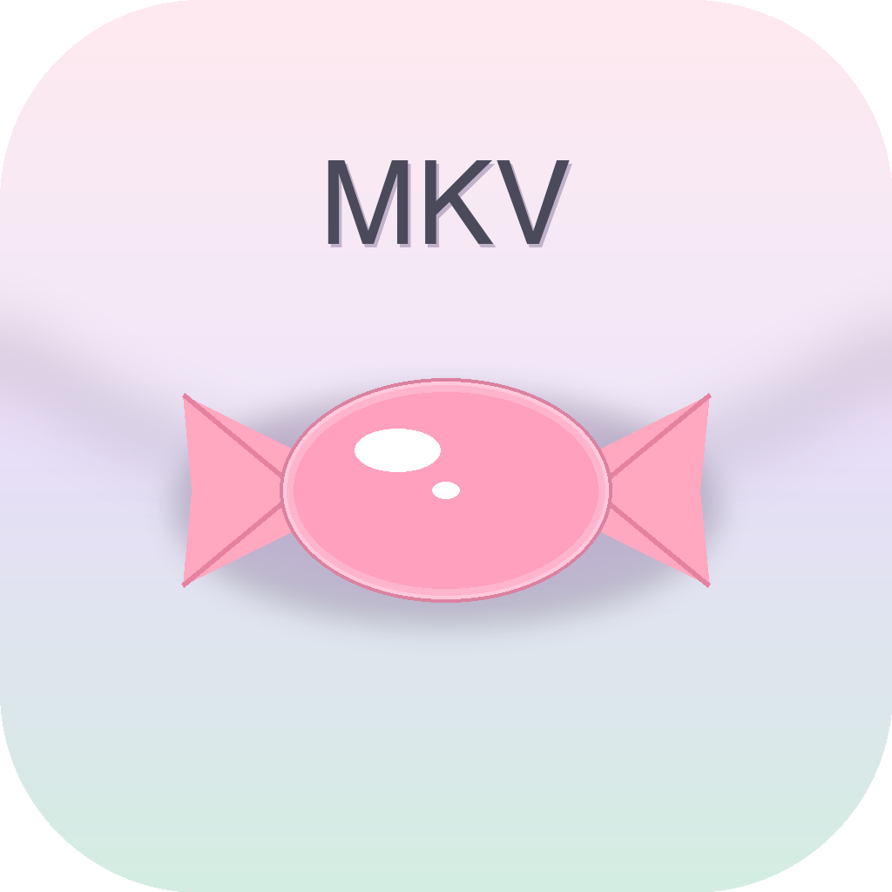

<div align="center">



# gMKVExtractGUI · macOS 端口

**马卡龙糖果配色 · 真毛玻璃 · 中文 UI · 原生 Apple Silicon**

[](https://dotnet.microsoft.com/)
[](https://avaloniaui.net/)
[](https://www.apple.com/macos/)
[](https://unlicense.org/)

</div>

---

## 这是什么

把 [Gpower2/gMKVExtractGUI](https://github.com/Gpower2/gMKVExtractGUI)（一个 [MKVToolNix](https://mkvtoolnix.download/) 的 Windows GUI 壳）**移植到 macOS 原生**：

- 业务逻辑层（gMKVToolNix 库）几乎照搬 — 解析 MKV、构造 `mkvextract` 命令行、Job 管理
- UI 层从 **.NET 4.0 WinForms** 完全重写为 **.NET 10 + Avalonia 11**
- 主题改为「**马卡龙糖果**」风格（粉/紫/薄荷/奶黄/天空蓝五色板），窗口背景是 **NSVisualEffectView 真毛玻璃**
- UI 改为**中文**
- 可以打包为标准 macOS `.app` bundle，**双击启动**

---

## 系统要求

| 项 | 要求 |
|---|---|
| macOS | 11 Big Sur 或更新 |
| 架构 | Apple Silicon (arm64) 或 Intel (x64) |
| 运行 | 无需装 .NET（`.app` 已 self-contained） |
| 提取功能 | 必须装 [MKVToolNix](https://mkvtoolnix.download/)：`brew install mkvtoolnix` |

⚠️ 没装 `mkvtoolnix` 也能开主窗口，但右侧轨道列表会空，「提取」会报错——这是图形壳，真正干活的是 `mkvextract` / `mkvmerge` 命令行工具。

---

## 安装

### 方式 A：下载预编译 `.app`（最简单）

从 [Releases](https://github.com/ji1360677347/gMKVExtractGUI-macos/releases) 下载 `gMKVExtractGUI.app.zip`，解压后拖到 `/Applications/`，双击启动。

### 方式 B：从源码构建

```bash
# 1) 装依赖
brew install --cask dotnet-sdk    # .NET SDK 10+
brew install mkvtoolnix           # mkvextract/mkvmerge CLI

# 2) 克隆并构建
git clone https://github.com/ji1360677347/gMKVExtractGUI-macos.git
cd gMKVExtractGUI-macos
./scripts/build_app.sh            # arm64
# 或 Intel: ARCH=x64 ./scripts/build_app.sh

# 3) 双击启动 或 拖到 /Applications/
open dist/gMKVExtractGUI.app
cp -R dist/gMKVExtractGUI.app /Applications/
```

构建产物 `dist/gMKVExtractGUI.app` 约 109 MB（含完整 .NET 10 runtime + Avalonia + 业务库 + 17 国语言 JSON）。

### 方式 C：开发模式（不打包）

```bash
export DOTNET_ROOT="/opt/homebrew/opt/dotnet/libexec"
export PATH="/opt/homebrew/opt/dotnet/bin:$PATH"
dotnet run --project src/gMKVExtractGUI.Avalonia
```

---

## 使用

1. **首次启动**：右上「自动探测」会自动找到 `mkvtoolnix` 路径（Homebrew 装的话是 `/opt/homebrew/bin`）；找不到提示先 `brew install mkvtoolnix`
2. **加载 MKV**：拖文件到主窗口任意位置，或点「浏览…」选择
3. **选轨道**：右侧自动列出视频/音频/字幕/章节/附件，逐行勾选要提取的项
4. **配置输出**：
   - 默认勾选「使用源」→ 提取到 MKV 所在目录
   - 取消勾选并指定其它目录
5. **设置格式**：
   - 「章节」下拉：XML / OGM / CUE / PBF
   - 「提取模式」下拉：Tracks / Cue_Sheet / Tags / Timecodes / Tracks_And_*
6. **开始**：点「提取 ▶」，进度条实时更新，状态栏显示当前正在提取的轨道名
7. **设置窗口**：自定义 6 种文件名 pattern、Raw 提取模式、BOM 选项
8. **日志窗口**：实时跟踪 mkvtoolnix 调用与应用事件，可保存到文件

### 默认文件名模板

| 类型 | 模板 |
|---|---|
| 视频 | `{FilenameNoExt}_track{TrackNumber}_[{Language}]` |
| 音频 | `{FilenameNoExt}_track{TrackNumber}_[{Language}]_DELAY {EffectiveDelay}ms` |
| 字幕 | `{FilenameNoExt}_track{TrackNumber}_[{Language}]` |
| 章节 | `{FilenameNoExt}_chapters` |
| 附件 | `{AttachmentFilename}` |
| 标签 | `{FilenameNoExt}_tags` |

完整占位符列表见 [gMKVExtractFilenamePatterns.cs](src/gMKVToolNix/MkvExtract/gMKVExtractFilenamePatterns.cs)。

---

## 项目结构

```
gMKVExtractGUI-macos/
├── src/
│   ├── gMKVToolNix/                  ← 业务源（共享，由两个 csproj 共用）
│   ├── gMKVToolNix.Core/             ← .NET 10 SDK 项目（包业务源 + 跨平台扩展）
│   │   ├── MkvExtract/ExtractionMode.cs
│   │   └── Platform/MkvToolnixLocator.cs
│   ├── gMKVExtractGUI.Avalonia/      ← Avalonia UI 项目
│   │   ├── Themes/Macaron.axaml      ← 马卡龙资源字典 + 控件样式
│   │   ├── Views/                    ← MainWindow / LogWindow / JobsWindow / OptionsWindow
│   │   ├── ViewModels/
│   │   ├── App.axaml + Program.cs
│   │   └── app.manifest
│   └── gMKVExtractGUI/               ← 旧 WinForms 项目（保留，Round 12 删）
├── scripts/
│   ├── make_icon.py                  ← 生成马卡龙糖果图标
│   └── build_app.sh                  ← 一键打包 .app
├── .orchestration/                   ← 夜跑调度（PLAN + PROGRESS）
├── night_runner_macos.sh             ← Opus + 2×Sonnet 自动接力开发
├── gMKVExtractGUI.macOS.sln          ← 新 sln（Round 12 后顶替旧 sln）
└── gMKVExtractGUI.sln                ← 原 Windows sln（Round 12 删）
```

---

## 开发进度

**当前**：Round 0 完成（项目骨架 + 主窗口 + 三个子窗口 + 提取主流程 + `.app` 打包）

**路线图**（[.orchestration/PLAN.md](.orchestration/PLAN.md)）：

| Round | 内容 |
|---|---|
| 1 | 业务库可编译 + UI 可启动（已提前完成） |
| 2 | mkvtoolnix 路径探测 + 真实轨道渲染（已提前完成） |
| 3 | mkvextract 调用 + 进度回传（已提前完成） |
| 4 | Job Manager 业务接通（UI 已有） |
| 5 | Options 窗口 + Settings 持久化（UI 已有） |
| 6 | 本地化集成 17 国语言（JSON 已包含） |
| 7 | Log 窗口业务接通（UI 已有） |
| 8 | TranslationEditor |
| 9 | 拖拽完善（多文件 / 文件夹 / append 模式） |
| 10 | 错误处理 + 启动恢复 |
| 11 | macOS 打包（已提前完成）+ 业务源就地化 |
| 12 | 最终清理：删除所有 Windows-only 残留 + 测试 + 文档 |

Round 4-10 由 [`night_runner_macos.sh`](night_runner_macos.sh) 调度（Opus 总指挥 + 2×Sonnet worker）夜间自动接力推进。

启动夜跑：
```bash
chmod +x night_runner_macos.sh
nohup ./night_runner_macos.sh > .orchestration/logs/nohup.log 2>&1 &
tail -f .orchestration/logs/night.log
```

---

## 技术栈

- **.NET 10**（C# 13，可空引用类型，pattern matching）
- **Avalonia 11.2** + Fluent Theme（跨平台原生 UI，macOS 走 Cocoa + Metal）
- **真毛玻璃**：`ExperimentalAcrylicBorder` + `TransparencyLevelHint=AcrylicBlur,Mica,Blur,Transparent`
- **MVVM**：自定义 `RelayCommand` + 手写 `INotifyPropertyChanged`
- **业务库**：原 .NET 4.0 源码 + `Microsoft.Win32.Registry` NuGet（macOS 上抛 PNS 由代码逻辑拦截）+ `Newtonsoft.Json`

---

## 与原项目的关系

本项目 fork 自 [Gpower2/gMKVExtractGUI](https://github.com/Gpower2/gMKVExtractGUI)（commit `c8d532e`），完整保留原作者全部 commit 历史。

**做了什么改动**：
- 上述 macOS 端口，UI 全部重写
- 业务逻辑（mkv 解析 / 命令构造 / Job 模型）**未改动业务接口**
- 旧 WinForms 项目仍可在 Windows 上编译运行（如果你愿意打开 `gMKVExtractGUI.sln`）

**Round 12 后**：删除全部 Windows-only 文件，只保留 macOS 产物——届时本仓库与原仓库**完全分叉**，不再兼容 Windows。

如果你需要 Windows 版，请直接用[原作者的 repo](https://github.com/Gpower2/gMKVExtractGUI)。

---

## 已知限制

- ⚠️ 提取过程中 mkvextract 的 stderr 暂未在 UI 显示，失败时只能看状态栏粗略提示——计划 Round 7 完整接 Log
- ⚠️ Settings（路径 / pattern / checkbox 状态）尚未持久化，重启后回到默认——Round 5 修
- ⚠️ Job Manager 队列调度未实现（UI 骨架已有）——Round 4 修
- ⚠️ `.app` 未做 Apple Developer 签名 + 公证，首次双击可能被 Gatekeeper 拦：右键「打开」一次即可永久放行
- ⚠️ 仅在 macOS 26 (Tahoe) + Apple Silicon 上验证过；Intel Mac 与更老 macOS 需自测

---

## License

继承原项目 — **[The Unlicense](https://unlicense.org/)**（公共领域）。

本仓库的所有新增代码（`src/gMKVToolNix.Core/Platform/`、`src/gMKVExtractGUI.Avalonia/` 全部、`scripts/`、`.orchestration/`、`night_runner_macos.sh`）一并放入公共领域，随意使用、修改、分发，不需要署名。

---

## 致谢

- **[Gpower2](https://github.com/Gpower2)**（Arslanoglou Georgios）—— 原作者，所有 mkv 解析与命令构造逻辑出自其手
- **[MKVToolNix](https://mkvtoolnix.download/)** —— 实际做工的核心 CLI
- **[Avalonia](https://avaloniaui.net/)** —— 跨平台 UI 框架，macOS 真毛玻璃靠它
- **Claude Code (Opus 4.7 + Sonnet 4.6)** —— 协助完成 macOS 端口
